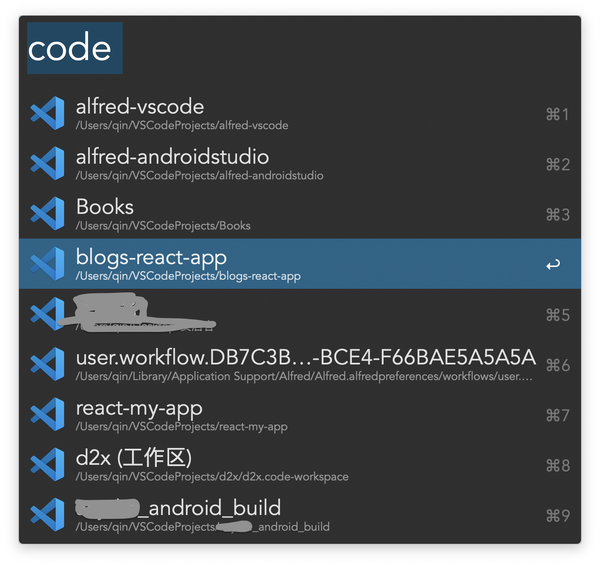

## Alfred workflow for VSCode

_Alfred 工作流，快速启动 VSCode 软件中打开过的项目_
_Alfred workflow for VSCode_

### 运行环境

- MacOS
- Nodejs 14.x.x
- Alfred Powerpack
- VSCode

### 安装

[安装包](./Open%20in%20VSCode.alfredworkflow)

### 使用方法

调出 alfred 搜索框输入关键字 code

1. 回车可使用 VSCode 打开项目, 按住 Command 键回车可在 Finder 中打开项目
2. 选择 Open VSCode，回车可使用 VSCode 打开当前 Finder 焦点文件

